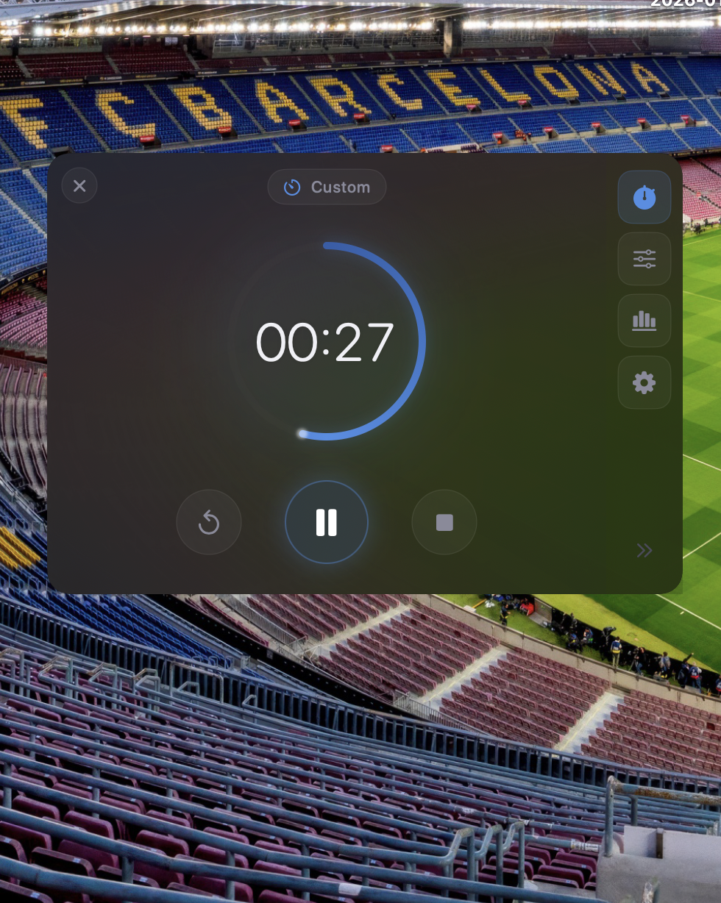
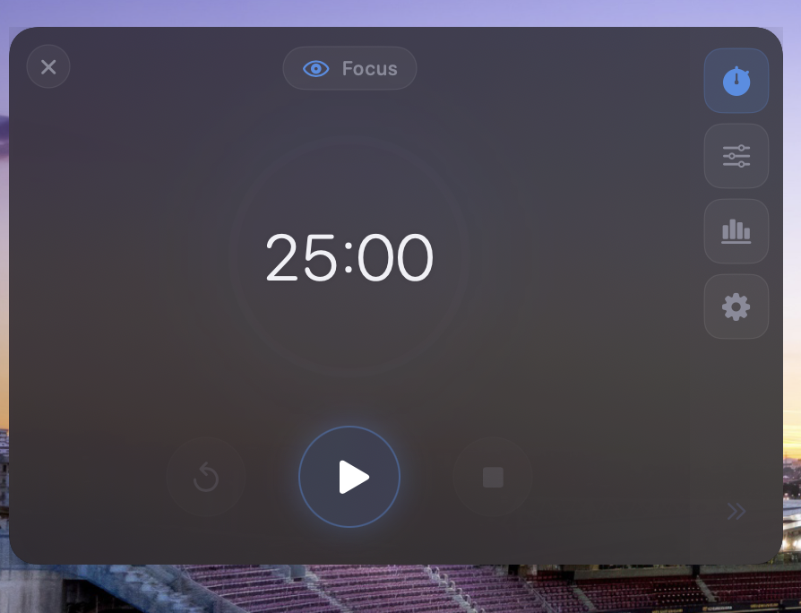
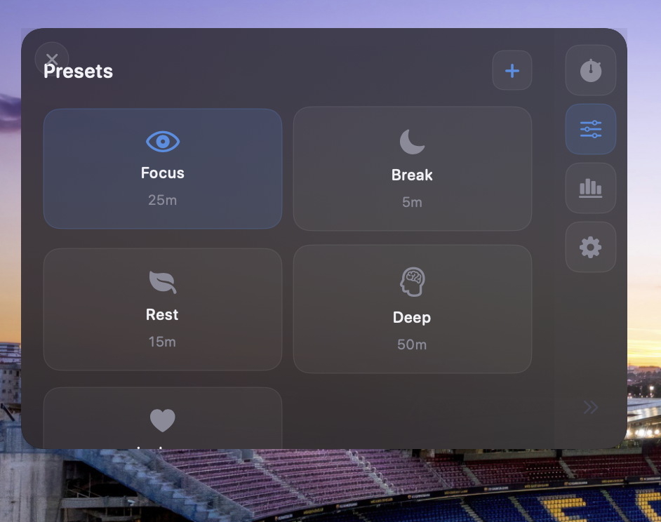
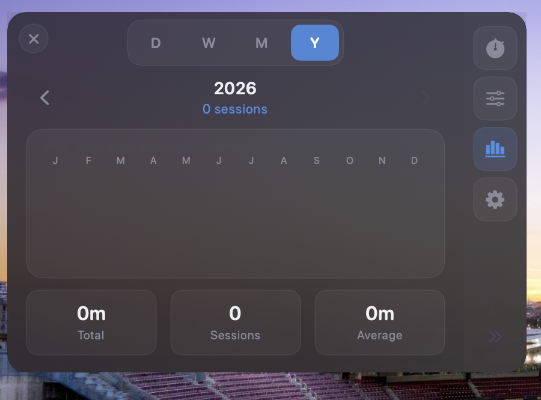
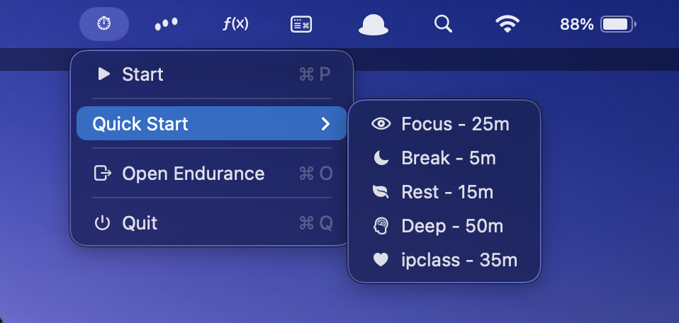
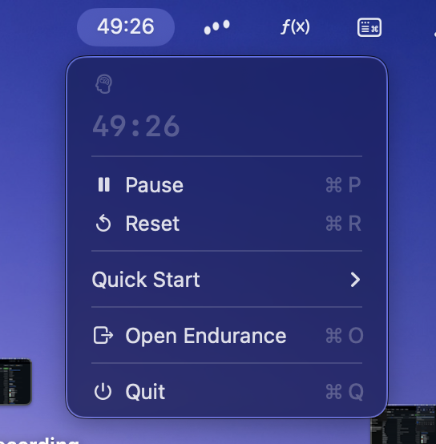

# Endurance

**A free, open-source menu bar timer for macOS.**

I got tired of paying for timer apps that do one simple thing.  
So I built my own.

 

---

## Screenshots

  
  

  

  
  

---

## Install

1. Download the latest `.dmg` from [**Releases**](https://github.com/pranav-dp/endurance/releases)
2. Drag to Applications
3. Done

> First launch: Right-click → Open (not notarized yet)

---

## Features

- Menu bar timer with live countdown
- Custom presets
- Session history & stats
- Global hotkey: `⌘ + Shift + T`
- Glassmorphism UI
- Dark/Light mode

---

## Requirements

- macOS 14.0+
- Apple Silicon or Intel

---

## License

[MIT](LICENSE)
